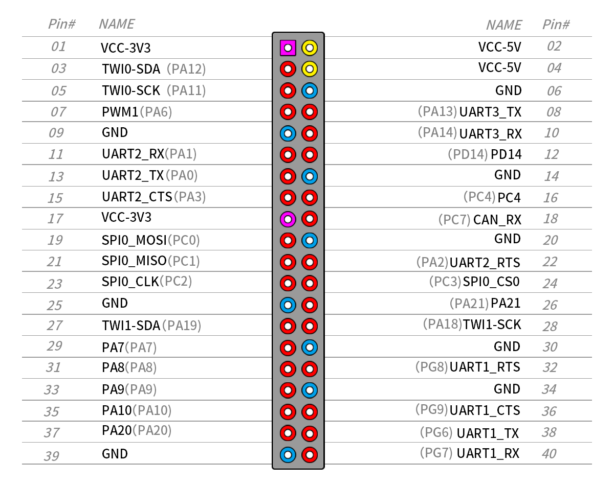
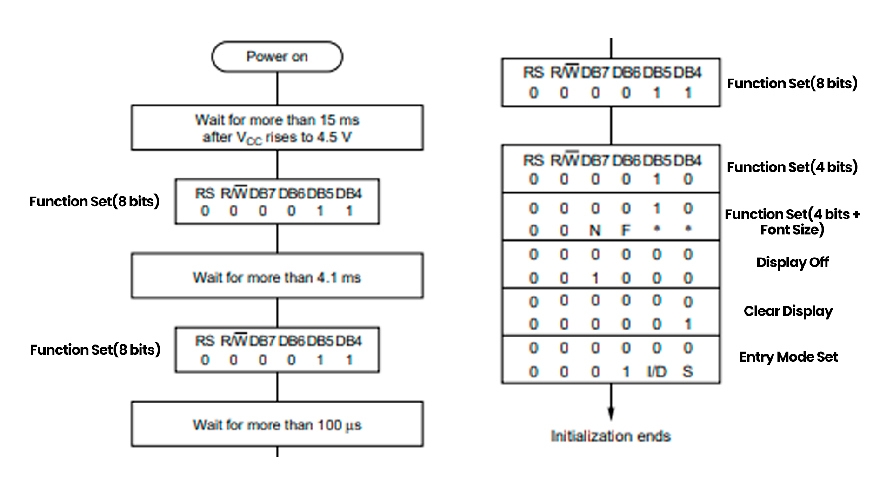

# Projeto de Sensor Digital em FPGA utilizando Comunicação Serial, Utilizando uma Interface Homem-Máquina.

### Desenvolvedores
------------

- [Vanderleicio Junior](https://github.com/Vanderleicio)
- [Washington Oliveira Júnior](https://github.com/wlfoj#-washington-oliveira-junior-)
- [Wagner Alexandre](https://github.com/WagnerAlexandre)
- [Lucas Gabriel](https://github.com/lucasxgb)

### Tutor 
------------

- [Thiago Cerqueira de Jesus](https://github.com/thiagocj)

### Sumário 
------------
+ [Introdução](#introdução)
+ [Características da Solução](#características-da-solução)
+ &nbsp;&nbsp;&nbsp;[Materiais Utilizados](#materiais-utilizados)
+ &nbsp;&nbsp;&nbsp;[Arquitetura do Computador](#arquitetura-do-computador)
+ &nbsp;&nbsp;&nbsp;[Instruções Utilizadas](#instruções-utilizadas)
+ &nbsp;&nbsp;&nbsp;[Mapeamento](#mapeamento)
+ &nbsp;&nbsp;&nbsp;[Pinagem](#pinagem)
+ &nbsp;&nbsp;&nbsp;[Display](#display)
+ &nbsp;&nbsp;&nbsp;[Uart](#uart)
+ [Como Executar](#como-executar)
+ [Comandos](#comandos)
+ [Testes](#Testes)
+ [Conclusões](#conclusões)
+ [Referências](#referências)

-------

# Diagrama de sistema

 
    

        <b>Figura 1: </b> Fluxo do projeto
    

## Introdução

  Este documento descreve a continuação do desenvolvimento de um sistema digital para controle de ambientes. O projeto está dividido em duas etapas, o leitor pode encontrar a descrição da implementação da primeira etapa 
  <a href="https://github.com/Vanderleicio/ProjetoSD01">Clicando aqui (Primeira Etapa)</a>. A segunda etapa, visa desenvolver uma interface homem-máquina que, receba comandos, se comunique com a FPGA, receba respostas e exiba essas respostas no Display LCD. Essa interface, deve substituir a implementada na primeira etapa utilizando a linguagem de programação C, atendendo os mesmos requisitos. Desta vez o protótipo será embutido em um computador de placa única (SBC) a Orange Pi PC Plus. Uma das restrições do projeto, é que a solução seja escrita em Assembly, linguagem que corresponde ao conjunto de instruções de uma arquitetura específica.

  A Orange PI PC PLUS possui o processador AllWinner H3, baseado na arquitetura ARM Cortex-A7, parte da família ARMv7. Essa arquitetura, presente em dispositivos como smartphones, tablets e IoT, suporta instruções de 32 bits. Esse tamanho das instruções permite ao processador lidar com uma ampla gama de operações, desde cálculos aritméticos até manipulação de memória. Nesse sentido, toda a construção da solução foi fundamentada nas instruções do ARMv7. As instruções específicas utilizadas serão melhor detalhadas nas próximas seções, oferecendo uma visão mais aprofundada do papel crucial dessas instruções na funcionalidade da solução.

## Características da Solução
----------

Este desafio pode ser resolvido por meio de três blocos principais: o bloco UART, o bloco de exibição (Display) e o mapeamento.
A comunicação serial ocorre através da UART, que conecta o FPGA à SBC Orange PI. Essa conexão permite a troca de informações específicas do sensor, tanto no envio quanto no recebimento de dados. Os dados provenientes da UART são armazenados em um registrador para posterior tratamento. Este tratamento é crucial para a correta disposição das respostas no display LCD, garantindo que cada informação seja exibida na posição correta da tela.
O Display, por sua vez, está vinculado aos GPIO da Orange PI. Ele exibe telas distintas conforme a interação do usuário. As informações sobre o sensor e os comandos desejados são inseridos pelo usuário utilizando chaves e botões que também estão conectados ao GPIO.
O mapeamento desempenha um papel crucial, permitindo a manipulação dos pinos utilizados nos GPIO. Este processo facilita a configuração e o controle preciso dos dispositivos conectados.
Ao longo deste relatório, detalharemos minuciosamente como cada bloco funciona em conjunto para criar uma solução completa.

----------
### Materiais utilizados

- `FPGA Cyclone IV EP4C30F23C7`
- `Orange PI PC PLUS`
- `Linguagem de programação Assembly`
- `Linguagem de descrição de hardware Verilog`

----------

### Arquitetura do Computador
Especificações técnicas:

| CPU | H3 Quad-core Cortex-A7 H.265/HEVC 4K   |
|:--- |                                   ---: |
| GPU |     Mali400MP2 GPU @600MHz             |
| Memória (SDRAM) |  1GB DDR3 (shared with GPU)|
| Armazenamento interno | Cartão MicroSD (32 GB); 8GB eMMC Flash|
| Rede embarcada | 10/100 Ethernet RJ45        |
| Fonte de alimentação | Entrada DC, entradas USB e OTG não servem como fonte de alimentação | 
| Portas USB | 3 Portas USB 2.0, uma porta OTG USB 2.0 |
| Periféricos de baixo nível | 40 pinos        |

----------

### Mapeamento

A Orange PI apresenta uma série de pinos de entrada e saída controláveis, além dos pinos específicos na SBC, como os pinos UART_TX e UART_RX, cada um com finalidades definidas. No contexto da nossa interface, o controle preciso da pinagem é crucial, pois a manipulação e transmissão de dados são essenciais para a funcionalidade principal da interface. 

No entanto, as instruções do ARMv7 não têm conhecimento direto dos pinos GPIO. Portanto, para interagir com esses pinos no assembly, é necessário acessar diretamente os registradores associados a eles, realizando leituras e escritas em locais específicos na memória. No ambiente Linux, o arquivo */dev/mem*, fornece um ponteiro que permite acessar diretamente a memória. Para realizar esse mapeamento de memória, são utilizadas chamadas de sistema, as chamadas syscall, que permitem aos programas solicitar serviços ao sistema operacional. Nesse contexto, a syscall utilizada é a mmpa2, responsável por mapear os endereços dos registradores internos da placa correspondente às configurações necessárias, em um endereço de memória virtual.

Para realizar a chamada do mmpa2, é importante que alguns registradores que são utilizados como parâmetros estejam preenchidos, são eles:
- `R0`: Dica para o endereço virtual que será utilizado, caso seja nulo, o linux escolherá
- `R1`: Comprimento da região de memória, múltiplo de 4096, que é o tamanho da página de memória
- `R2`: Proteção de memória
- `R3`: Descritor de arquivo, usado para abrir o *dev/mem*
- `R5`: O endereço do GPIO / 4096, o endereço do gpio divido pelo tamanho da página de memória, utilizado para calcular o deslocamento necessário para mapear um endereço físico no espaço de memória virtual.

Os dados que são utilizados no R0, R1 e R5 são passados na seção .data. Todas as funcionalidades que necessitam acessar pinos da SBC, utilizam o método de mapeamento, como o caso do mapeamento das gpio e da UART, o que muda entre elas é o valor do endereço base dos registradores.

----------

### Pinagem

A partir do mapeamento de memória é possível acessar o endereço virtual dos pinos. A Figura 1, mostra em detalhes como é a organização dos pinos GPIO da Orange PI PC Plus.

    
    

        <b>Figura 2:</b> Descrição da pinagem
    

Para manipular os pinos, algumas etapas são necessárias no processo:
    
- Em nossa abordagem, adicionamos o valor padrão do <i>Offset</i> (0x800) do GPIO a um registrador específico.
- Acessamos os registradores GPIO utilizando um deslocamento baseado no *Offset*
- Ao passar o *Offset* do registrador de dados do pino, é possível carregar as informações contidas nessa posição de memória para um registrador. Essas informações representam o estado atual do pino.

A partir desse ponto, uma vez que as informações do registrador foram carregadas para um registrador específico, é possível executar operações desejadas relacionadas ao pino. Isso pode incluir configurações adicionais, como definir a direção do pino, alterar o estado do pino, entre outras operações específicas para os GPIO.

----------

### Display

   
Conectado à porta GPIO está o Display LCD 16x2, dedicado a apresentar uma interface ao usuário. Equipado com o controlador HD44780U da Hamachi, é capaz de exibir caracteres alfanuméricos e símbolos. 

Para visualizar as informações recebidas, é essencial definir previamente um conjunto de funcionalidades, incluindo configurações de comunicação entre os dados recebidos da FPGA e o display, protocolos adequados, inicialização do display e formatação dos dados para exibição precisa no LCD. Cada passo é crucial para garantir uma correta exibição das informações na tela. Utilizamos uma macro para realizar a inicialização do display, a Figura 3 exibe o fluxo de inicialização do display.

    
    

        <b>Figura 3:</b> Fluxo de inicialização do display 
    

A inicialização do display com o controlador HD447780U, delineada no DataSheet, é essencial para configurar corretamente o dispositivo. Este fluxo estabelece as instruções fundamentais para o início do funcionamento do display. Em nossa solução, além de seguir esse padrão, incorporamos funcionalidades adicionais.

Antes de detalharmos as instruções, é importante destacar a conexão dos pinos que são utilizados para realizar a comunicação entre o SBC e o display. O pino RS desempenha o papel crucial de informar ao display o tipo de comando enviado, enquanto o pino Enable é responsável por enviar os dados dos pinos de dados (DB7 a DB4) para o display.

Nossa implementação emprega o modo de comunicação de 4 bits, otimizando o uso de pinos GPIO. Isso significa que o envio de dados ocorre duas vezes para transmitir os 8 bits necessários para operação do display, utilizando os pinos DB4 a DB7.

O processo de inicialização do display segue uma sequência específica, embora nossa implementação tenha algumas distinções em relação à ordem convencional. No início, são enviadas quatro instruções consecutivas do "Function Set". As três primeiras configuram o modo de operação com 8 bits, enquanto a última estabelece o display no modo de operação de 4 bits, definindo assim as características do modo de exibição. Cada instrução possui um tempo de espera determinado. Após a última instrução do "Function Set", é enviada uma outra instrução para manter a configuração de 4 bits e determinar o tamanho da fonte desejado.

Na sequência, as instruções "Display Off" e "Clear Display" são enviadas para desligar e limpar o display, respectivamente. Em seguida, é transmitida uma instrução do "Entry Mode Set" com as configurações de deslocamento específicas que desejamos. Após esse processo, o display é inicializado e se torna pronto para receber informações a serem escritas no LCD. É importante ressaltar que as instruções são encaminhadas do microcontrolador para o LCD através dos pinos de dados, de db0 a db7. Este processo detalhado de configuração e inicialização garante o correto funcionamento do display e prepara o ambiente para a exibição de informações. Abaixo podemos ver uma breve descrição das instruções.

- Configuração dos pinos de controle:
    - Pino RS: Seleciona se os dados enviados que serão enviados ao display, vão ser encaminhados para o registrador de dados (caso seja um dado a ser exibido) ou uma instrução. 
         - Descrição Nível Lógico: 
            - Nível Lógico Baixo:  Registrador de Instrução
            - Nível Lógico Alto: Registrador de Dados

    - Pino E: Envia os dados presentes nos pinos.
        - Enviar os dados:Alterando do nível alto pro baixo
        - Estado de espera: Nível baixo

- Function Set (4 Bits):
    -  Determina algumas características chaves do funcionamento do display.
    -  Pino 1:
        - Tamanho da interface de comunicação
            - Nível Lógico Baixo: Comunicação utilizando 4 bits
            - Nível Lógico Alto: Comunicação utilizando 8 bits
    - Pino 2 e 3: 
        - Configuram o tamanho da fonte que estamos utilizando, de acordo com combinações de bits.

- Display On/Off:
    - Controla alguns aspectos do display
    - Pin 1:
        - Nível Lógico Baixo: Display desligado, não vemos nenhum caractere. Mas os caracteres que estavam escritos não são apagados.
        - Nível Lógico Alto: Display Liga novamente
    - Pin 2: Controla o cursor
        - Nível Lógico Baixo: Cursor desligado
        - Nível Lógico Alto: Cursor Ligado
    - Pin 3:
        - Nível Lógico Baixo: Cursor não pisca
        - Nível Lógico Alto: Cursor pisca

- Clear Display:
    - Usado para limpar qualquer comando que esteja escrito na tela.
    - Nível Lógico Alto: Realizar a limpeza.  

- Entry mode set: 
    - Configuração de alguns parâmetros de deslocamento do cursor.
    - Utiliza dois pinos de dados para realizar a sua configuração
        - Pino 1:
            - Nível Lógico Baixo: Cursor deslocado para a esquerda.
            - Nível Lógico Alto: Cursor deslocado para a direita.
        - Pino 2:
            - Nível Lógico Baixo:  Não Ocorre deslocamento.
            - Nível Lógico Alto:    Display inteiro é deslocado para a direção selecionado no pino 1.

----------

#### Exibição no Display

Com o display inicializado, torna-se possível a exibição de dados e interação com o display. Inicialmente construímos instruções que auxiliam na montagem da tela especifica. A função WriteCharLCD permite escrever caracteres individuais na tela, enquanto WriteNumberLCD é útil para exibir números. Além disso, funções como o deslocamento do cursor para a direita e a manipulação dos valores (como separar a dezena da unidade) são cruciais para o tratamento dos dados do sensor e para apresentar esses valores de forma compreensível no display.
Essas instruções simplificam a construção das interfaces de interação com o usuário, facilitando a exibição de dados e a interação com o display. Com elas, é possível estruturar telas específicas para diferentes propósitos, tornando a experiência do usuário mais intuitiva e amigável.

Para enviar dados ou comandos para o display, os valores correspondentes aos bits são colocados nos pinos DB4-DB7, com os primeiros 4 bits representando os bits mais significativos e os 4 seguintes representando os bits menos significativos. Isso é parte do processo de comunicação serial. Além disso, a escrita no HD44780U segue um diagrama temporal para sincronizar os tempos de envio dos dados ou comandos. O HD44780U requer uma sequência de sinais de controle (como o sinal de enable, o sinal de R/S) em tempos específicos para que os dados sejam interpretados corretamente.
Uma escrita típica envolve colocar os dados nos pinos DB4-DB7, seguido pela configuração de outros pinos de controle, como RS (Register Select) para indicar se os dados são comandos ou caracteres a serem exibidos, e o pulso de habilitação (E) para indicar quando os dados estão prontos para serem lidos pelo display.

----------

### Uart
O modulo UART é responsável pela comunicação entre a placa FPGA, que coleta as informações dos sensores, e a Orange PI, responsável por receber as entradas do usuário e exibir as informações requeridas.
Para utilizar a UART da Orange PI PC PLUS, é necessário os seguintes passos:

- Inicializar, no início do fluxo, as configurações referentes a UART.

- Sequência: 
Resetar a UART -> Habilitar a saída do clock -> Configurar fonte do clock -> Liberar o gating do clock para a UART -> Configurações da UART.

- Características da UART utilizada: 9600 bps de baudrate, 8 bits de dados, 1 bit de início e 1 bit de fim;
  
- Para envio e para o recebimento de dados, basta escrever e ler nos registradores correspondentes;

--------------
## Como Executar

### Comandos

Para enviar um comando, são necessários dois passos:
+ 1: Acessar a tela de comandos e posicionar as chaves ao numero relativo (em binário) ao sensor a ser enviado e pressionar o botão de ok.
+ 2: Posicionar as chaves o valor do comando (em binário) a ser enviado e pressionar o botão de ok.

Ao todo existem 7 comandos:

| Código | Descrição  do comando   |
|:--- |                                   ---: |
| 0000 |     Solicita a situação atual do sensor.             |
| 0001 |  Solicita a medida de de temperatura atual do sensor. |
| 0010 | Solicita a medida de umidade atual.|
| 0100 |Ativa sensoriamento continuo de umidade.        |
| 0101 |Desativa sensoriamento continuo de temperatura. |
| 0110 |Desativa o sensoriamento continuo de umidade. |

--------------
## Testes
--------------

    
    

        <b>Figura 4:</b> Posição das chaves 0000, esse comando solicita a situação atual do sensor. Nesse caso a resposta foi positiva, o sensor está ativo e funcional.  
    

    
    

        <b>Figura 5:</b> Posição das chaves 0001, comando solicita a medida de temperatura atual do sensor específico 
    

  
    

        <b>Figura 6:</b> Posição das chaves 0010, comando solicita a medida de umidade atual do sensor
    

 
    

        <b>Figura 7: </b> Posição das chaves 0101, comando desliga o sensoriamento continuo de temperatura
    

    

       <b>Figura 8: </b> Posição das chaves 0110, comando desliga o sensoriamento continuo de umidade 
    

## Conclusões

Concluímos que todas as demandas e requisitos estabelecidos foram plenamente atendidos. O projeto concluído consiste na criação de uma Interface Homem-Máquina apresentada em um display LCD, com a interação facilitada por meio de chaves e botões. Destaca-se que essa solução foi elaborada de modo a satisfazer as necessidades e expectativas do usuário, cumprindo eficientemente com o propósito estabelecido.

--------------
## Referências

[Datasheet do processador AllWinter H3 ](https://drive.google.com/drive/folders/1JmgtWTlGA-hPv47cLtEYZa-Y3UZPSQNN) : Datasheet do processador, contem as informações dos endereços bases e offsets que permitem a configuração da pinagem. 

[Datasheet display LCD ](https://www.sparkfun.com/datasheets/LCD/HD44780.pdf) : Datasheet que descreve o funcionamento do display LCD, que é utilizado em conjunto a SBC.

[Raspberry Pi Assembly Language Programming]() : Livro que introduz conceitos de Assembly, e implementação de funcionalidades.
