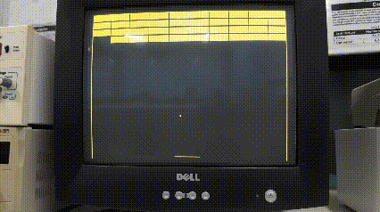
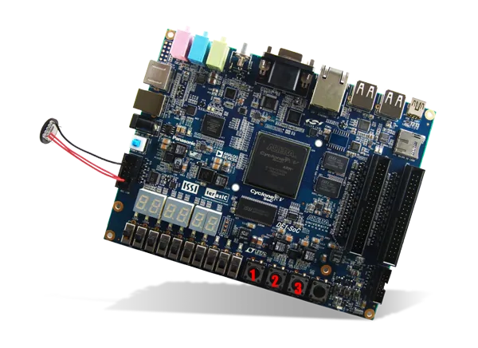

# Projeto de jogo "Breakout" em C para a placa DE1-SoC.

### Desenvolvedores
------------

- [Vanderleicio Junior](https://github.com/Vanderleicio)
- [Washington Oliveira Júnior](https://github.com/wlfoj#-washington-oliveira-junior-)
- [Wagner Alexandre](https://github.com/WagnerAlexandre)
- [Lucas Gabriel](https://github.com/lucasxgb)

### Tutor 
------------

- [Thiago Cerqueira de Jesus](https://github.com/thiagocj)

### Sumário 
+ [Introdução](#introdução)
+ [Materiais Utilizados](#materiais-utilizados)
+ &nbsp;&nbsp;&nbsp;[Hardware Utilizado](#hardware-utilizado)
+ &nbsp;&nbsp;&nbsp;[Softwares Utilizados](#Softwares-utilizados)
+ [Características da Solução](#características-da-solução)
+ &nbsp;&nbsp;&nbsp;[Drivers](#drivers)
+ &nbsp;&nbsp;&nbsp;[Lógica do Jogo](#lógica-do-jogo)
+ &nbsp;&nbsp;&nbsp;[Telas de Exibição](#telas-de-exibição)
+ &nbsp;&nbsp;&nbsp;[Controles](#controles)
+ [Como Executar](#como-executar)
+ [Testes](#Testes)
+ [Conclusões](#conclusões)
+ [Referências](#referências)

## Introdução

Este documento relata o processo completo necessário para o desenvolvimento de um jogo inspirado no clássico Breakout. Visando o desenvolvimento de uma experiência de jogo envolvente capturando os elementos do jogo original, com um enfoque particular na adaptação para o kit de desenvolvimento DE1-SoC.

A jogabilidade do *Breakout* ([História do Breakout](https://www.youtube.com/watch?v=bC_KPLe5dYg)) é caracterizada por sua simplicidade. Na parte superior da tela, uma matriz de blocos é disposta, enquanto uma bola percorre a área, limitada pelos extremos laterais. A mecânica central do jogo é refletir a bola ao colidir com os blocos ou as bordas da tela. O jogador enfrenta a derrota caso a bola alcance a região inferior da tela, desprovida de limitadores. Para evitar tal desfecho, o jogador conta com uma barra móvel que atua como um escudo, tanto para evitar a derrota quanto para direcionar o trajeto da bola.

Este projeto visa desenvolver um código em linguagem C que englobe tanto a lógica do jogo *Breakout* quanto as operações de controle e interação com o kit de desenvolvimento DE1-SoC, que além de ter disponível os recursos de FPGA, possui um Processador ARM Cortex A9 dual-core. Isso implica operar os botões do kit para iniciar, pausar e continuar o jogo, bem como manipular a exibição dos dados na saída de vídeo conectada ao controlador VGA conectada a um monitor CRT. Para realizar o controle mencionado, foram empregados os drivers de dispositivos da Intel FPGA, os quais facilitam a interação com as portas de entrada e saída disponíveis no kit DE1-SoC. Esses drivers permitem a comunicação direta com os componentes do hardware. As seções a seguir detalharão o desenvolvimento desta solução, abordando a integração dos módulos disponíveis no kit para alcançar os objetivos propostos.

## Materiais Utilizados

### Hardware Utilizado

- Kit de desenvolvimento `DE1-SoC`.

### Softwares Utilizados

- Linguagem de Programação C.

## Características da Solução

Podemos dividir o desenvolvimento em três módulos distintos: a lógica de jogo, a criação, exibição e manipulação de telas, e o controle. É crucial ressaltar que, em todas as etapas, a utilização dos drivers de dispositivos desempenhou um papel fundamental. Ao empregar esses drivers, foi possível abstrair muitas complexidades associadas ao acesso direto aos endereços físicos das portas do hardware.

O módulo de lógica do jogo é responsável por controlar todos os aspectos essenciais do jogo, incluindo colisões, movimentação e resultados. Para viabilizar a visualização da jogabilidade, conectamos um monitor CRT à porta VGA do kit de desenvolvimento. Mais uma vez, o auxílio dos drivers foi indispensável para estabelecer essa conexão. Por fim, o módulo de controle regula a interação do usuário com o jogo, definindo como as funcionalidades são acessadas e utilizadas.

Ao longo deste relatório, iremos detalhar minuciosamente o funcionamento de cada módulo em conjunto com os drivers, proporcionando uma compreensão abrangente de como esses elementos se integram para criar uma solução completa.

## Drivers
Além do processador ARM A9, que faz parte do kit de desenvolvimento Cyclone V SoC (DE1-SoC), também temos uma FPGA disponível. O processador é utilizado para executar uma variante do sistema operacional Linux, e diversos dispositivos periféricos estão conectados a ele, incluindo entradas e saídas de uso geral. Utilizamos a variante do Linux chamada DE1-SoC-UP, conforme documentado em [Usando Linux em placas da série DE](https://ftp.intel.com/Public/Pub/fpgaup/pub/Intel_Material/17.0/Tutorials/Linux_On_DE_Series_Boards.pdf). A utilização do Linux nos permite compilar o código de forma nativa, utilizando sua interface de linha de comando.

Com o ambiente Linux, temos a possibilidade de construir o código de forma mais próxima ao "baixo nível". Isso se deve ao fato de que o Linux utiliza um sistema de memória virtual, onde o endereço físico do hardware precisa ser mapeado para um endereço virtual, para que o sistema operacional possa manipular as informações contidas na porta específica do hardware. Nesse cenário, o programador é responsável por realizar o mapeamento manualmente, informando ao código o dispositivo de memória do sistema */dev/mem*, realizando a chamada de sistema para mapear o arquivo para a memória virtual e, em seguida, acessando as portas utilizando o endereço base mais o deslocamento necessário. Este processo é essencial para garantir a comunicação eficiente entre o software e o hardware, permitindo o controle e a interação adequados com os dispositivos periféricos conectados à FPGA.

Entretanto, a distribuição Linux utilizada oferece diversos módulos pré-construídos, os quais facilitam a comunicação com os dispositivos de hardware presentes no computador DE1-SoC. Esses módulos realizam abstrações e disponibilizam métodos para a utilização de portas específicas. Cada driver é associado a um arquivo específico para leitura e escrita de informações nele. Na Tabela 1, apresentamos os módulos pré-construídos disponíveis para comunicação com o hardware ( [Usando Linux em placas da série DE](https://ftp.intel.com/Public/Pub/fpgaup/pub/Intel_Material/17.0/Tutorials/Linux_On_DE_Series_Boards.pdf).). 

| Módulos Kernel | Descrição |
|-------------|-------------|
| KEY | Usado para acessar a porta KEY do botão |
| SW | Usada para acessar a porta SW do interruptor deslizante |
| LEDR | Usado para acessar a porta LEDR |
| HEX | Usado para acessar a porta HEX de sete segmentos |
| video | Usado para acessar a porta de saída de video VGA |
| audio | Usado para acessar a porta de áudio digital |
| accel | Usado para acessar a porta do acelerômetro 3D |

  <b>Tabela 1:</b> Módulos pré-construídos

  Esses módulos pré-construídos simplificam significativamente o desenvolvimento de software para interagir com os periféricos do DE1-SoC. Uma vez que, na linguagem C é fornecido um conjunto de funções para cada dispositivo de driver. Essa abstração ajuda os desenvolvedores a se concentrarem na lógica da aplicação, em vez de lidarem diretamente com os detalhes de baixo nível do hardware.

  Para construção da solução, foram utilizados as funcionalidades de três drivers específicos, *KEY*, *video*, *accel*.

  ### Driver Key
  
  O módulo KEY, é utilizado para operar sobre os *pushbuttons* que estão presentes na placa. Esse módulo possue três funcionalidades principais.

  - #### open
    Essa funcionalidade é utilizada para realizar a abertura do dispositivo */dev/mem*, essa função também realiza a chamada de sistema *memmap* que realiza o mapeamento da memória física para memória virtual.
  - #### read
    Após realizar o mapeamento e acessar os registradores da porta KEY, a função recebe um parâmetro ponteiro que aponta para um inteiro, que é utilizado para retornar o estado do botão. Temos quatro botões na placa, caso o usuário selecione o botão mais a esquerda, o valor do parâmetro é igual a 8, caso não receba nada o valor é 0. 
  - #### close
    Essa funcionalidade fecha o arquivo */dev/mem* que da acesso aos endereços físicos.
  - #### Driver vídeo
    O computador DE1-SoC possui uma porta de saída de vídeo conectada ao controlador VGA, que possibilita a conexão com um monitor. Este monitor suporta uma resolução de tela de até 640x480 pixels. A imagem exibida na saída de vídeo é derivada de duas fontes principais: um buffer de pixels e um buffer de caracteres. Esses buffers servem como armazenamento temporário para os dados de imagem que serão exibidos na tela.

##### Buffer de pixel
  O buffer de pixel armazena os dados de cor de cada pixel que será exibido no monitor. Para desenhar uma imagem na tela, é necessário acessar cada pixel, o que é feito combinando o endereço base do buffer de pixels com as coordenadas de cada pixel, determinadas pelos pares ordenados (x, y). No sistema de coordenadas, o canto superior esquerdo da tela corresponde à localização (0, 0).
  Dessa forma, podemos calcular o endereço de memória de cada pixel na tela e escrever os valores de cores correspondentes nesses endereços. O controlador de buffer de pixel lê esses dados para verificar se eles podem ser exibidos na tela. No entanto, essa abordagem permite que o usuário altere o buffer de pixel enquanto o conteúdo ainda está sendo exibido, o que pode causar artefatos visuais indesejados. Para evitar isso, utilizamos o conceito de buffer duplo.
  O buffer duplo emprega dois registradores de buffer: um para o buffer que está sendo exibido atualmente e outro para o "backbuffer". Na prática, o buffer de pixel apontado pelo registrador de buffer é exibido na tela, enquanto o "backbuffer" recebe o desenho de uma nova imagem. Quando o último pixel do buffer atual é exibido, ocorre uma troca: a nova imagem é exibida e o buffer que já foi exibido agora é apontado pelo registrador de "backbuffer", enquanto o buffer atual é limpo e está pronto para receber uma nova imagem a ser desenhada. 

##### Buffer de caracteres 
  O buffer de caracteres armazena os dados que representam os caracteres a serem exibidos na tela. Os caracteres são armazenados em blocos utilizando seus códigos ASCII. Quando esses códigos de caracteres são exibidos no monitor, o buffer de caracteres automaticamente gera o padrão correspondente de pixels para cada caractere usando uma fonte integrada.
  De forma semelhante ao buffer de pixel, a exibição dos caracteres na tela ocorre através de uma combinação de endereço base e deslocamento, permitindo o acesso a cada local na tela.
  
  Essa explicação fornece uma compreensão do funcionamento do módulo de vídeo. Além disso, ao disponibilizar funções de "open" e "close" para abertura e fechamento do dispositivo VGA, além do seu mapeamento, o driver de vídeo concentra-se no controle e na exibição de informações no monitor

- #### video_read()
  A funcionalidade video read serve para obter informações sobre o tamanho do monitor, e sobre a o tamanho do texto;

- #### video_box()
    Essa funcionalidade desenha um retângulo preenchido no monitor. A explicação também se aplica a outra funcionalidade utilizada no desenvolvimento, chamada "video_line", que opera de maneira semelhante, alterando somente a quantidade de parâmetros recebidos.
    A função recebe informações sobre dois pontos que formam os cantos do retângulo, bem como a cor que o retângulo deve conter. Para manipular a cor dos pixels dentro do retângulo, trabalhamos com o endereçamento, utilizando os pontos passados como parâmetros para inserir o valor da cor desejada nos endereços correspondentes dos pixels.
    Os valores passados como parâmetro, representando os pontos (x1, y1) e (x2, y2), são utilizados para calcular os endereços dos pixels. Isso é feito adicionando os valores binários de x1 e y1 ao endereço base, resultando no endereço específico do pixel na tela. Essa abordagem permite controlar e definir a cor de cada pixel dentro do retângulo, possibilitando a criação de formas geométricas preenchidas de maneira eficiente e precisa.

- #### video_text()
    A função video_text recebe a posição x e y, juntamente com o caractere que será escrito na tela. A lógica por trás da escrita de texto é bastante semelhante à do buffer de pixels, pois requer a obtenção do endereço onde os caracteres serão armazenados.
    Para determinar o endereço do caractere na posição, somamos o endereço base do buffer de caracteres com os valores binários de (x, y). Essa soma resulta no endereço da localização de escrita na memória do buffer de caracteres.
    Os caracteres são armazenados utilizando códigos ASCII. Quando esses códigos são exibidos no monitor, o buffer de caracteres gera automaticamente o padrão correspondente de pixels para cada caractere, utilizando uma fonte integrada. Isso permite uma representação visual precisa e legível do texto na tela do monitor.
 
- #### video_show()
    Essa funcionalidade desempenha um papel crucial na alternância entre os buffers do VGA. Sempre que a função "video_show" é chamada, ocorre a troca entre os buffers de pixel. Essa troca é realizada após a exibição completa de uma imagem na tela. Na prática, a função "video_show" exibe a nova imagem desenhada no antigo "backbuffer", que agora se torna o buffer de pixel ativo.

### Driver accel

Esse driver é responsável pelo controle sobre o acelerômetro que está disponível na placa, o acelerômetro realiza a leitura fornece medições de aceleração nos eixos, x, y, z. O sensor presente na placa é o ADXL345, utilizando uma comunicação através de um barramento serial I2c. Os fios I2C são roteados através do bloco pin mux, que pode ser utilizado para passar os sinais ao controlador I2C0, para um controlador GPIO ou para FPGA.

Nesse caso, precisamos que ADXL345 compartilhe os dados com o controlador, pois ele que ficará responsável por intermediar e realizar o controle sobre as informações de dados que são passados pelo acelerômetro. Para realizar a comunicação deve haver uma configuração inicial sobre o controlador I2C0, para que possa ficar estabelecido que o mesmo quer operar em cima do sensor ADXL345.

Para isso uma serie de configurações acontece, primeiramente a conexão entre os fios, que deve ser configurada para realizar a comunicação com o ADXL345, configurar o modo de operação do controlador, e também configurações especificas de clock para comunicação. Após essa conexão torna-se possível ler e gravar dados dos registradores internos do ADXL345.

Depois de realizar a comunicação dos fios, e o controlador já estiver configurado, podemos então utilizar os registradores que estão mapeados para a memória virtual, para ler e gravar os registros internos do ADXL345, como já vimos anteriormente, a utilização dos endereços e funções de mais "baixo nível" são abstraídas pela utilização dos drivers. 

Nesse caso especifico, para realizar a abertura (mapeamento) e calibração tanto do sensor como do controlador, utilizamos as funções *open*, *calibrate*.

- #### accel_init()
  Realiza a inicialização do controlador I2C0 como do sensor ADXL345, essa função é responsável por realizar as configurações adequadas ao controlador e ao sensor para que seja possível ao controlador ter acesso as informações do sensor.

- #### accel_read()
  A função `read` recebe referências que apontarão para os valores determinados em cada eixo (x, y, z), essa função acessa os registradores de dados presentes no acelerômetro, anteriormente mapeados, lendo o valor presente nos seis registros data do sensor ADXL345 e definindo esse valor como o valor das referências.

- #### accel_calibrate()
  A função `calibrate` serve para calibrar o eixo x do dispositivo de aceleração na posição atual.
  Não recebe parâmetros e possui retorno nulo.

- #### accel_format()
  A função `format` configura o formato dos dados de aceleração.
  Recebe dois parâmetros:
  * full: Um valor inteiro que define a resolução total.
  * range: Define o alcance G, onde G = {2, 4, 8, 16}.

- #### accel_rate()
  Define a taxa de atualização dos dados de aceleração.
  Recebe somente um parâmetro:
  * rate: a taxa de dados em Hz, onde R = {25,12.5,6.25,1.56,0.78}

## Lógica do Jogo

  Para criar a lógica do jogo, começamos definindo um conjunto de estruturas que representam os elementos fundamentais do jogo: a tela, a bola, os blocos e a barra. Cada estrutura é recebe os atributos específicos necessários, informações dos pontos que definem sua posição, vetores responsáveis por realizar a movimentação, são alguns desses atributos.

  Uma vez que as estruturas estão instanciadas, inicializamos os drivers relevantes utilizando a funcionalidade "open()" disponibilizada por cada um deles. Isso nos permite estabelecer a comunicação e interação adequadas com os periféricos do hardware, como a tela e os controles de entrada.

  Após obter os dados sobre o tamanho da tela, procedemos à construção dos objetos. Isso inclui a criação da gaiola limitadora, da barra e dos blocos dispostos na parte superior da tela. O objetivo principal do jogo é quebrar todos os blocos, enquanto se evita que a bola atravesse a parte inferior da tela. Para isso, o jogador controla a barra utilizando o acelerômetro, movendo-a horizontalmente para rebater a bola e mantê-la em jogo. Essa dinâmica define o desafio central e a mecânica básica do jogo.

- #### Colisão e movimentação
  Para movimentar a barra, aproveitamos o acelerômetro 3D disponível na placa.   Esse sensor nos fornece valores para os eixos x, y e z, porém, para nossa aplicação, nos concentramos apenas no valor de x. Para garantir uma movimentação responsiva, dividimos o valor de x recebido do acelerômetro por 12. Assim, se a barra estiver dentro dos limites da gaiola, adicionamos o valor resultante (x/12) à posição atual da barra. Isso proporciona uma movimentação suave e controlada.

  A estrutura da bola inclui uma lista de inteiros com tamanho 2, que funcionam como vetores de direção, representando as alterações nas posições x e y da bola, respectivamente.
  Para movimentar a bola, simplesmente atribuímos valores positivos ou negativos a cada elemento da lista, indicando a direção do movimento.
  
  O sistema de colisão é baseado nesse formato. Para detectar colisões com os blocos, verificamos se a posição da bola está dentro das coordenadas (x1, y1) e (x2, y2) de um determinado bloco. Se estiver, isso indica uma colisão. Em seguida, determinamos o tipo de colisão (esquerda, direita, superior ou inferior) para ajustar os valores na lista. Por exemplo, se houver uma colisão inferior, significa que a bola está se movendo de baixo para cima, então precisamos alterar o valor de y para fazer a bola refletir na direção oposta.
  A lógica de colisão segue um padrão semelhante para a barra e a gaiola, permitindo que o jogo reaja de forma adequada às interações entre os elementos, garantindo uma experiência de jogo envolvente e desafiadora.

### Telas e Testes

Esta seção tem como objetivo apresentar alguns testes conduzidos após o desenvolvimento do jogo, bem como exibir as telas resultantes geradas por esses testes.
- #### Iniciar Jogo

esta tela, o jogo aguarda a interação do usuário, que pode iniciar o jogo através do primeiro botão. Se qualquer outro botão for pressionado, o jogo permanece nesta tela.
- #### Jogando

Neste teste, observamos o funcionamento integral da lógica do jogo. Primeiramente, ocorre a colisão da bola com a barra, resultando na reflexão da bola e seu retorno para o lado oposto da tela. Em seguida, testamos outra interação crucial: a destruição de um bloco quando a bola entra em contato com ele. Esse é o princípio fundamental do jogo, onde o objetivo é destruir todos os blocos utilizando a barra para direcionar a bola.

- #### Pausado

Tela de pause, aqui o jogo espera a entrada de continuar para despausar o jogo e continuar a partida.

- #### Jogo Encerrado

Neste teste, avaliamos a funcionalidade que confirma a derrota do jogador. Isso acontece quando a bola ultrapassa o limite inferior da tela. Nesse momento, uma mensagem de derrota é exibida e o usuário é solicitado a reiniciar o jogo.

### Controles

- Lista dos botões e suas funções:
- **1** - Para iniciar/despausar o jogo.
- **2** - Para Pausar o jogo.
- **3** - Para reiniciar o jogo quando perder.

Para controlar a barra, segure a `DE1-SoC` de modo que a saída VGA fique na direção oposta ao seu corpo e simplesmente incline a `DE1-SoC` para a esquerda para mover a barra para a esquerda e incline-a para a direita para mover a barra para a direita.

## Como Executar

### Compilando e executando o jogo
Ao executar pela primeira vez: execute o arquivo `Makefile` para realizar a compilação do código e executar o jogo.

### Iniciando o jogo novamente
Toda vez que for iniciar novamente o jogo, somente é necessário executar o arquivo `mainv2.exe` gerado pela compilação. Em caso de perda do `mainv2.exe`, somente execute o arquivo `Makefile` novamente.

## Testes

## Conclusões

Podemos concluir que o desenvolvimento do jogo foi bem sucedido, atendendo todos os requisitos solicitados, cumprindo eficientemente com o propósito estabelecido, bem como se divertindo na programação. Pontos como o score, e vidas, podem ser incrementados para tornar um jogo ainda mais fiel ao original.

## Referências

[História do Breakout](https://www.youtube.com/watch?v=bC_KPLe5dYg): Vídeo utilizado como inspiração para a solicitação do desenvolvimento do jogo.

[Usando linux em placas da série DE](https://ftp.intel.com/Public/Pub/fpgaup/pub/Intel_Material/17.0/Tutorials/Linux_On_DE_Series_Boards.pdf): Material utilizado para estudo e desenvolvimento da aplicação
